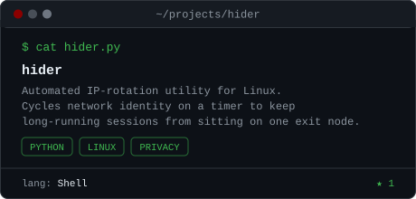
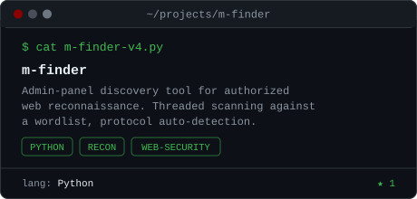
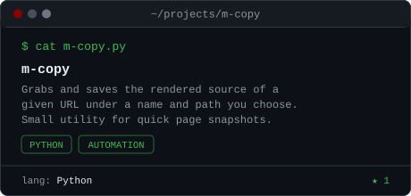

<div align="center">

<a href="https://github.com/kaandgnsh">
  
</a>

<br>

<a href="https://instagram.com/kaandgn.sh"></a>
<a href="https://github.com/kaandgnsh"></a>


</div>

<br>

```
┌──[kaan@security-lab]─[~]
└─$ whoami
```

## `~/identity`

Software Engineering student focused on understanding software and systems from the inside out — how they're built, how they break, and what it takes to secure them.

- Currently learning at the intersection of **Software Engineering · Cybersecurity · Linux · Networking**
- Habit: build something, take it apart, figure out why it works, try to make it better
- Publishing tools while learning, not after — the repos below are work in progress by design

<br>

```
┌──[kaan@security-lab]─[~]
└─$ systemctl status kaan

  ● learning.service      active (running)
  ● building.service      active (running)
  ● curiosity.service     active (running)
```

---

## `~/focus`

<div align="center">


</div>

```
   NETWORK  ──▶  LINUX  ──▶  APPLICATION  ──▶  SECURITY
```

Currently exploring how operating systems, networks, and applications actually behave under the hood — and where security fits into each layer of that stack.

---

## `~/toolbox`

<div align="center">

</div>

```
$ cat toolbox.txt

LANGUAGES
├── Python
├── Java
├── C
└── JavaScript

SYSTEMS
├── Linux
└── CLI / process internals

SECURITY
├── Networking fundamentals
└── Web & system security concepts

TOOLING
├── Git / GitHub
├── VS Code
└── Docker
```

---

## `~/projects`

<sub>Selected from the repos I've actually shipped — early-stage tools built while learning, not polished products. A few older / throwaway repos aren't shown here on purpose. Star/language data on each card is pulled live from the GitHub API by <a href="scripts/cards.py"><code>scripts/cards.py</code></a>, run daily by <a href=".github/workflows/cards.yml">a workflow</a> — not hardcoded.</sub>

<table>
<tr>
<td width="50%"></td>
<td width="50%"></td>
</tr>
</table>
<table>
<tr>
<td width="50%"></td>
<td width="50%" valign="middle" align="center">

```
$ ls ~/projects

hider/
m-finder/
m-copy/
...
```

<sub>more on <a href="https://github.com/kaandgnsh?tab=repositories">the repositories tab</a></sub>

</td>
</tr>
</table>

---

## `~/currently-learning`

```
[01] Python & software architecture
[02] Linux & system administration
[03] Networking
[04] Cybersecurity fundamentals
[05] Algorithms & data structures
[06] Automation
```

---

## `~/activity`

<div align="center">


<br>


<br><br>


<br><br>

<!-- generated on a schedule by .github/workflows/snake.yml, pushed to the
     orphan `output` branch so it never clutters main -->


</div>

---

## `~/contact`

<div align="center">

</div>

<div align="center">
<sub>

**kaan** · [@kaandgnsh](https://github.com/kaandgnsh) · [@kaandgn.sh](https://instagram.com/kaandgn.sh)

</sub>
</div>
